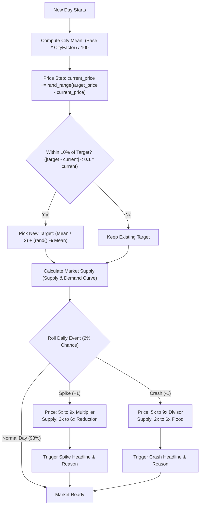

# Drug Lord 2 — Market Economics & Price Engine Reverse Engineering Report

This report documents the reverse-engineered price mechanics, economic formulas, data structures, and daily simulation algorithms of **Drug Lord 2** from the disassembly of the binary `druglord2.exe`.

---

## 1. Drug Base Price Table

The game defines a static array of 17 drug structures located in the `.data` section at virtual address `0x00419030` (file offset `0x017030`). Each drug entry is 24 bytes (`0x18`) wide.

The table below lists all 17 drugs with their internal base price ($P_{\text{base}}$), standard mean price, and baseline normal min/max range at a standard $100\%$ city multiplier:

| Index | Drug Name | Min Price | Mean Price | Max Price | Normal Range |
|:---:|:---|:---:|:---:|:---:|:---:|
| 1 | **Cocaine** | 2,550 | 5,100 | 7,650 | 50 |
| 2 | **Crack** | 3,500 | 7,000 | 10,500 | 50 |
| 3 | **Ecstacy** | 1,500 | 3,000 | 4,500 | 50 |
| 4 | **Hashish** | 800 | 1,600 | 2,400 | 50 |
| 5 | **Heroin** | 3,500 | 7,000 | 10,500 | 50 |
| 6 | **Ice** | 1,500 | 3,000 | 4,500 | 50 |
| 7 | **Kat** | 400 | 800 | 1,200 | 50 |
| 8 | **LSD** | 500 | 1,000 | 1,500 | 50 |
| 9 | **MDA** | 500 | 1,000 | 1,500 | 50 |
| 10 | **Morphine** | 1,000 | 2,000 | 3,000 | 50 |
| 11 | **Mushrooms** | 200 | 400 | 600 | 50 |
| 12 | **Opium** | 750 | 1,500 | 2,250 | 50 |
| 13 | **PCP** | 400 | 800 | 1,200 | 50 |
| 14 | **Peyote** | 500 | 1,000 | 1,500 | 50 |
| 15 | **Pot** | 400 | 800 | 1,200 | 50 |
| 16 | **Special K** | 750 | 1,500 | 2,250 | 50 |
| 17 | **Speed** | 400 | 800 | 1,200 | 50 |

---

## 2. City Price Multipliers & Global Price Ranges

Each of the 15 cities in the game has a specific price factor (stored at offset `+0x84` in each city structure starting at `0x004191c8` with stride `0x0a88`):

| Multiplier | Cities |
|:---:|:---|
| **80%** | Detroit, San Francisco |
| **90%** | Miami, Paris |
| **100%** | Austin, New York, Toronto, Vancouver *(Baseline)* |
| **110%** | London, Los Angeles, Sydney |
| **120%** | Boston |
| **150%** | St Petersburg |
| **160%** | Moscow |
| **190%** | Beijing |

### Global Absolute Min / Max Across All Cities

Accounting for the lowest city factor ($80\%$ in Detroit and San Francisco) and highest city factor ($190\%$ in Beijing), the absolute standard price boundaries are:

| Drug Name | Absolute Min | City Mean Range | Absolute Max |
|:---|:---:|:---:|:---:|
| **Cocaine** | 2,040 | 4,080 – 9,690 | 14,535 |
| **Crack** | 2,800 | 5,600 – 13,300 | 19,950 |
| **Ecstacy** | 1,200 | 2,400 – 5,700 | 8,550 |
| **Hashish** | 640 | 1,280 – 3,040 | 4,560 |
| **Heroin** | 2,800 | 5,600 – 13,300 | 19,950 |
| **Ice** | 1,200 | 2,400 – 5,700 | 8,550 |
| **Kat** | 320 | 640 – 1,520 | 2,280 |
| **LSD** | 400 | 800 – 1,900 | 2,850 |
| **MDA** | 400 | 800 – 1,900 | 2,850 |
| **Morphine** | 800 | 1,600 – 3,800 | 5,700 |
| **Mushrooms** | 160 | 320 – 760 | 1,140 |
| **Opium** | 600 | 1,200 – 2,850 | 4,275 |
| **PCP** | 320 | 640 – 1,520 | 2,280 |
| **Peyote** | 400 | 800 – 1,900 | 2,850 |
| **Pot** | 320 | 640 – 1,520 | 2,280 |
| **Special K** | 600 | 1,200 – 2,850 | 4,275 |
| **Speed** | 320 | 640 – 1,520 | 2,280 |

---

## 3. Data Structures & Memory Layout

### Drug Definition Struct (`0x00419030`, Stride `0x18` = 24 bytes)
```c
struct DrugDefinition {
    const char *name;         // +0x00: Pointer to null-terminated ASCII drug name
    int32_t     base_price;   // +0x04: Base mean price in dollars
    int32_t     param_min;    // +0x08: Minimum volume parameter
    int32_t     param_max;    // +0x0C: Maximum volume parameter
    int32_t     player_qty;   // +0x10: Quantity in player's current pockets
    int32_t     player_basis; // +0x14: Player's average cost basis per unit
};
```

### Live Market Drug Slot (`0x00419294`+, Stride `0x14` = 20 bytes)
```c
struct MarketSlot {
    int32_t     quantity;     // -0x04: Units currently available in market
    int32_t     current_price;// +0x00: Current trading price per unit
    int32_t     target_price; // +0x04: Dynamic price target being drifted towards
    int32_t     event_flag;   // +0x08: 0 = Normal, +1 = Price Spike, -1 = Price Crash
    int32_t     rumor_flag;   // +0x0C: 0 = None, 1 = True Rumor, 2 = False Rumor
};
```

---

## 4. Daily Market Simulation Algorithm

The routine at `0x004052d0` executes at the start of each day to update prices and available supply across all markets.



### Step 1: Base Price Scaling
For each drug in each city:
$$\text{Mean} = \left\lfloor \frac{P_{\text{base}} \times \text{CityFactor}}{100} \right\rfloor$$
$$\text{Half} = \left\lfloor \frac{\text{Mean}}{2} \right\rfloor$$
$$\text{MinPrice} = \text{Mean} - \text{Half} = 50\% \text{ of Mean}$$
$$\text{MaxPrice} = \text{Mean} + \text{Half} = 150\% \text{ of Mean}$$

### Step 2: Price Drift Towards Dynamic Target
Prices do not jump randomly; they drift smoothly toward `target_price`:
$$\Delta = \text{target\_price} - \text{current\_price}$$
$$\text{step} = \begin{cases} 
\text{rand}() \bmod \Delta & \text{if } \Delta > 0 \\
-(\text{rand}() \bmod |\Delta|) & \text{if } \Delta < 0 \\
0 & \text{if } \Delta = 0 
\end{cases}$$
$$\text{current\_price}_{\text{new}} = \text{current\_price} + \text{step}$$

### Step 3: Target Regeneration
When the current price gets within **10%** of the current target ($|\Delta| < \lfloor 0.10 \times \text{current\_price} \rfloor$), a new target is chosen uniformly within the valid normal range:
$$\text{target\_price}_{\text{new}} = \text{Half} + (\text{rand}() \bmod \text{Mean})$$

### Step 4: Supply & Demand Curve (Available Quantity)
Market supply is inversely related to price, scaled by the player's rank capacity ($\text{Cap}_{\text{rank}}$ at `0x004230f0`):
* **Wannabe**: $10$
* **Small-Time Operator**: $25$
* **Dealer**: $100$
* **Big-Time Dealer**: $600$
* **Distributor**: $3,500$
* **Drug Lord**: $20,000$

The market quantity is calculated and smoothed against the previous day:
$$\text{TargetQty} = \text{Cap}_{\text{rank}} \times \left(1 - \frac{\text{current\_price} - \text{MinPrice}}{\text{Mean}}\right)$$
$$\text{quantity}_{\text{new}} = \max\left(0, \left\lfloor \frac{\text{TargetQty} + \text{quantity}_{\text{old}}}{2} \right\rfloor\right)$$

---

## 5. Market Events (Spikes and Crashes)

Every day, each drug in a market has an independent **1 in 50 (2%)** chance of triggering a major market disruption.

### A. Price Spike Event (`event_flag = +1`)
* **Trigger Chance**: $1\%$ (50% of the 2% event roll)
* **Mechanics**:
  $$\text{Multiplier} = (\text{rand}() \bmod 5) + 5 \quad \implies 5\times \text{ to } 9\times$$
  $$\text{current\_price} = \left(\text{Mean} + (\text{rand}() \bmod \text{Half})\right) \times \text{Multiplier}$$
  $$\text{quantity} = \left\lfloor \frac{\text{quantity}}{(\text{rand}() \bmod 5) + 2} \right\rfloor \quad \implies \text{divided by } 2\times \text{ to } 6\times$$
* **Sample In-Game Narrative**:
  * *Reason*: `"Cops burst into a %s warehouse, seizing everything."`
  * *Headline*: `"Prices go through the roof!"` / `"Prices are outrageous!"` / `"Prices are astronomical!"`

### B. Price Crash Event (`event_flag = -1`)
* **Trigger Chance**: $1\%$ (50% of the 2% event roll)
* **Mechanics**:
  $$\text{Divisor} = (\text{rand}() \bmod 5) + 5 \quad \implies 5\times \text{ to } 9\times$$
  $$\text{current\_price} = \left\lfloor \frac{\text{Mean} - (\text{rand}() \bmod \text{Half})}{\text{Divisor}} \right\rfloor$$
  $$\text{quantity} = \text{quantity} \times ((\text{rand}() \bmod 5) + 2) \quad \implies \text{multiplied by } 2\times \text{ to } 6\times$$
* **Sample In-Game Narrative**:
  * *Reason*: `"A police warehouse is broken into and %s is stolen."` / `"Crates of %s were discovered floating in the ocean."`
  * *Headline*: `"Prices are rock bottom!"` / `"Prices drop like lead balloons!"` / `"Prices plummet!"`
